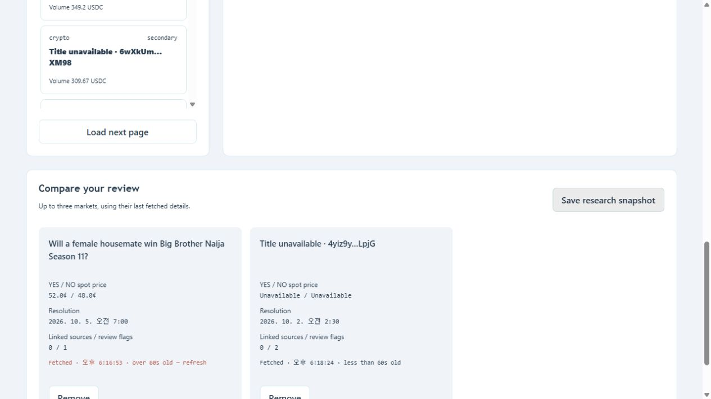

# Resolution Lens

A read-only research workspace for Panta prediction markets. Put each market's prices beside its returned resolution wording, source links, timestamps and recent trades; compare markets and export a dated review.

Built for the Panta API Sidetrack of Colosseum Crypto World's Fair, September 2026. Superteam received the sidetrack submission on September 30. Official Colosseum registration and submission remain pending. No prize has been awarded.

[Watch or download the 96-second product walkthrough](demo/resolution-lens-walkthrough.mp4)

[2-minute 24-second product presentation](pitch/resolution-lens-product-pitch.mp4) · [Editable pitch deck](pitch/resolution-lens-product-pitch.pptx)



## What works

- Browse Panta markets with phase/category filters and cursor pagination.
- Search the pages already loaded, including titles returned by a later detail request.
- Inspect independent YES/NO quotes, returned descriptions and timestamps.
- Show missing resolution wording and links explicitly, without inventing rules.
- Load up to 50 recent trade records, preserving their original amounts.
- Compare up to three fetched markets and download a timestamped JSON snapshot.
- Use clearly labeled synthetic examples without an API key.

## Run the prototype

Requires Node.js 22 or later. No npm dependencies or installation step.

```sh
git clone https://github.com/harry-kim-droid/resolution-lens.git
cd resolution-lens
npm start
```

Open `http://127.0.0.1:4317` and select **Open synthetic example**. These example events, prices and trades are invented and exports identify them as synthetic.

For authenticated reads, supply your own authorized Panta API key in the server process's `PANTA_API_KEY` environment variable and restart. On Windows, `Start-Live.ps1` offers a masked input prompt and starts a separate viewer on port 4318. Credentials are not included in this repository or passed to the browser. The server listens only on loopback; it is not a public hosted API proxy.

The optional local key-storage utilities use Windows user encryption. They do not contain a key. Another user must obtain and authorize their own Panta access. API pricing and commercial access terms have not been established by this prototype; a payment-required response stops further upstream reads for that server process.

## Panta integration

The local server forwards authenticated GET requests to `https://live-api.panta.market/api/v1` for the market catalog, market detail and recent trades. It keeps the API key on the server, rejects cross-site/foreign-origin access, sanitizes upstream failures and applies a cooldown on rate limits. No wallet, order or trading endpoint is available in the viewer. Panta attribution remains visible.

On September 30, authorized live-key reads returned 40 markets across two pages, a market detail with YES/NO quotes, nine trade records and a two-market browser export. Provider metadata was incomplete: most initial catalog titles were blank, and the reviewed detail had no resolution wording. Missing fields and null quotes stay unavailable. A live key does not establish that every returned market is economically active or that its rules are valid.

The [walkthrough](demo/resolution-lens-walkthrough.mp4) is a silent, English-captioned sequence of seven real browser screenshots and a summary slide. It shows dated observations rather than current prices. [Captions](demo/walkthrough.vtt) and the [capture manifest](demo/walkthrough-manifest.json) accompany it. The separate [product presentation](pitch/resolution-lens-product-pitch.mp4) uses six slides with English on-screen text and lasts 2 minutes 24 seconds. It covers verified product behavior and business hypotheses. The [PPTX](pitch/resolution-lens-product-pitch.pptx) preserves editable text and citations in speaker notes. Both videos are silent and do not record the entrant speaking.

## Validation and limits

```sh
npm test
```

The 24 Node tests cover review behavior, server restrictions, simulated upstream responses, paid-response stopping and a disposable Windows encrypted-key round trip. Live-read browser evidence was checked separately. The video is 96 seconds, 1920x1080, H.264 at 24 fps, with full-file decoding checked.

Prices are independent quotes and are not normalized to total 100. The 60-second stale indicator is a local cue, not an upstream freshness guarantee. Linked URLs are returned description content, not verified authorities. The viewer cannot assess missing rules or verify market outcomes. Search covers loaded pages; the trade view is not complete history.

## Product hypothesis and development

Researchers need a repeatable way to review what a quoted event means before comparing markets. Resolution Lens brings the returned data together and makes its gaps visible. External user demand is not yet validated. Next work is to investigate missing provider metadata and test the review workflow with actual researchers.

The prototype was built with AI coding assistance. It has no customers, commercial revenue or awarded contest funds. Potential shared review histories and annotations are product hypotheses, not promised features or validated paid demand.

Official references: [Panta API documentation](https://docs.panta.market/), [Panta sidetrack requirements](https://superteam.fun/earn/listing/panta-api-side-track), [Colosseum Crypto World's Fair](https://colosseum.com/hackathon?year=fall2026).
